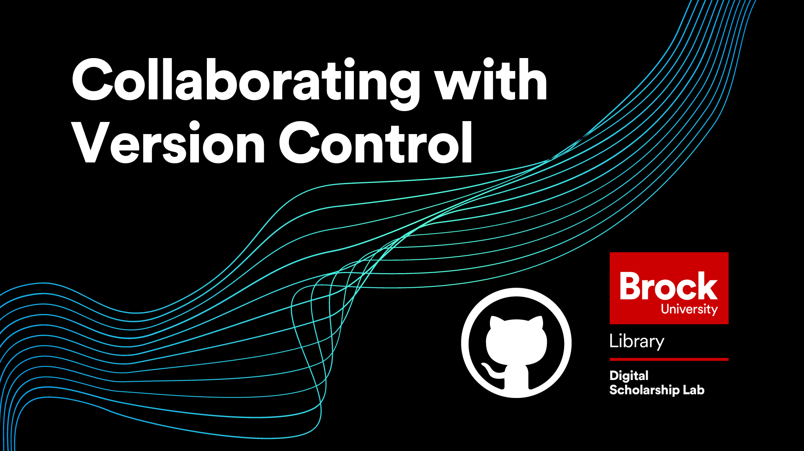

# Collaborating with Version Control on GitHub
In this workshop, attendees will learn about the different ways that GitHub can be used to collaborate on projects including organizations, collaborators, issues, forking, and pull requests.  This workshop is the second in the GitHub Workshop Series offered by the Brock University Digital Scholarship Lab.

A basic understanding of using repositories in GitHub is recommended for this workshop.  

*Estimated workshop length: 1.5 hours*

----
## Setup
In preparation for this workshop, you will need the following: 

 - A GitHub account which you can get by clicking the "Sign Up" button at the top right of [https://github.com/](https://github.com/).
 - GitHub Desktop which can be acquired at [https://desktop.github.com/](https://desktop.github.com/).  Keep in mind that if you are not using a personal computer for this workshop, you may need to contact your IT department for permission to install new software.
 - A GitHub repository with at least one file that you can edit in it.  Even a brand new repository with just a README file will do.  

----
## Next Steps
After completing this workshop, the recommended next steps are:

 - Try working on something together with a friend or colleague.  GitHub doesn't just have to be for work!  You can plan a party, store photos, or anything else you can think of!  Just make sure to use private repositories for personal or sensitive information.  Using the tool frequently will ensure you don't forget the terminology and keep things fresh in your mind.
- Check out the other workshops in our introduction to GitHub Series
   - [Introduction to GitHub Repositories and GitHub Desktop](https://brockdsl.github.io/Introduction-to-GitHub-Repositories-and-GitHub-Desktop/)
   - [Making a Free Webpage with GitHub Pages](https://brockdsl.github.io/Making-a-Free-Webpage-with-GitHub-Pages/)
   - [Automating tasks with GitHub Actions](https://brockdsl.github.io/Automating-tasks-with-GitHub-Actions/)
  

----
 
 

  
**This workshop is brought to you by the Brock University Digital Scholarship Lab.  For a listing of our upcoming workshops go to [Experience BU](https://experiencebu.brocku.ca/organization/dsl) if you are a Brock affiliate or [Eventbrite page](https://www.eventbrite.ca/o/brock-university-digital-scholarship-lab-21661627350) for external attendees.**

